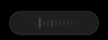
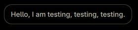

# VoxType Activity Overlay

A [DankMaterialShell](https://github.com/AvengeMedia/DankMaterialShell) daemon plugin that shows a live microphone activity overlay while [VoxType](https://github.com/peteonrails/voxtype) is recording.

## Features

<p align="center">
  
  <br/>
  
</p>

- Bottom-of-screen audio visualizer pill driven by Cava
- Frequency-bar and scrolling-waveform visualizer modes
- Optional button to cancel the current recording
- Animated bar heights that react to microphone input
- Optional final transcript bubble that appears after VoxType finishes transcribing
- Configurable visualizer sensitivity, transcript timing, and overlay opacity
- All settings configurable from DMS settings UI

## Requirements

- [DankMaterialShell](https://github.com/AvengeMedia/DankMaterialShell) >= 1.5.0
- [VoxType](https://github.com/peteonrails/voxtype) speech-to-text daemon
- [cava](https://github.com/karlstav/cava) audio visualizer
- [PipeWire](https://pipewire.org) (for mic capture)

## Install

### Quick start (recommended)

```sh
git clone https://github.com/agneswd/dms-voxtype-activity-overlay \
  ~/.config/DankMaterialShell/plugins/dms-voxtype-activity-overlay
sh ~/.config/DankMaterialShell/plugins/dms-voxtype-activity-overlay/setup.sh
systemctl --user restart voxtype.service
dms restart
```

Then enable in **DMS Settings → Plugins → Scan for Plugins → VoxType Activity Overlay**.

### Manual setup

Alternatively, follow the steps below if you prefer to configure things yourself.

**1. Clone the plugin**

```sh
git clone https://github.com/agneswd/dms-voxtype-activity-overlay \
  ~/.config/DankMaterialShell/plugins/dms-voxtype-activity-overlay
```

**2. Configure Cava**

```sh
mkdir -p ~/.config/cava
cp ~/.config/DankMaterialShell/plugins/dms-voxtype-activity-overlay/config/cava/dms-voxtype-activity-overlay.ini \
  ~/.config/cava/dms-voxtype-activity-overlay.ini
```

**3. Connect VoxType to the overlay**

Run the setup script:

```sh
sh ~/.config/DankMaterialShell/plugins/dms-voxtype-activity-overlay/setup.sh
```

If you already use a VoxType post-processing command, setup preserves it and
runs the transcript capture afterward. Unsupported or ambiguous configurations
are left untouched with an explanation instead of being rewritten.

**4. Restart services**

```sh
systemctl --user restart voxtype.service
dms restart
```

**5. Enable in DMS**

1. Open **Settings - Plugins**
2. Click **Scan for Plugins**
3. Enable **VoxType Activity Overlay**

### Uninstall

```sh
sh ~/.config/DankMaterialShell/plugins/dms-voxtype-activity-overlay/setup.sh --uninstall
```

This restores the post-processing block that was present at installation and
removes files created by setup.

## Settings

| Setting | Default | Description |
|---------|---------|-------------|
| Visualizer Mode | Scrolling Waveform | Switch between a smooth scrolling waveform and live frequency bars |
| Visualizer Sensitivity | 180% | Scales how much the bars react to mic input |
| Show Cancel Button | on | Cancel the current recording without transcribing it |
| Show Final Transcript | on | Display the final recognized text after transcribing |
| Transcript Time On Screen | 3600ms | How long the transcript bubble stays visible |
| Pill Opacity | 94% | Overall opacity of the recording pill |
| Transcript Opacity | 96% | Overall opacity of the transcript bubble |

## How it works

```
VoxType (recording)  →  Cava (audio visualizer)  →  Pill (frequency bars)
                                                         ↓
VoxType (transcribing)  →  VoxType (idle)  →  post_process hook
                                                         ↓
                                           capture script saves transcript
                                                         ↓
                                           DMS plugin reads and shows bubble
```

The overlay is a full-width transparent layer-shell window pinned to the bottom edge. The pill and transcript bubble are centered inside it, so they work at any screen width.

## Repository layout

```
dms-voxtype-activity-overlay/
├── DmsVoxtypeActivityOverlay.qml
├── DmsVoxtypeActivityOverlaySettings.qml
├── plugin.json
├── scripts/              # Helper script for VoxType post_process hook
├── config/               # External program configs
│   └── cava/             # Cava visualizer config
├── tests/                # Setup and uninstall checks
├── setup.sh              # One-command setup script
├── LICENSE
└── README.md
```

## License

MIT

Waveform mode and the cancel interaction were inspired by [VoxType OSD](https://github.com/irisblur17/dms-voxtype-osd) by Iris Blur.

The settings UI uses selected components from [dms-common](https://github.com/hthienloc/dms-common) by Loc Huynh.
